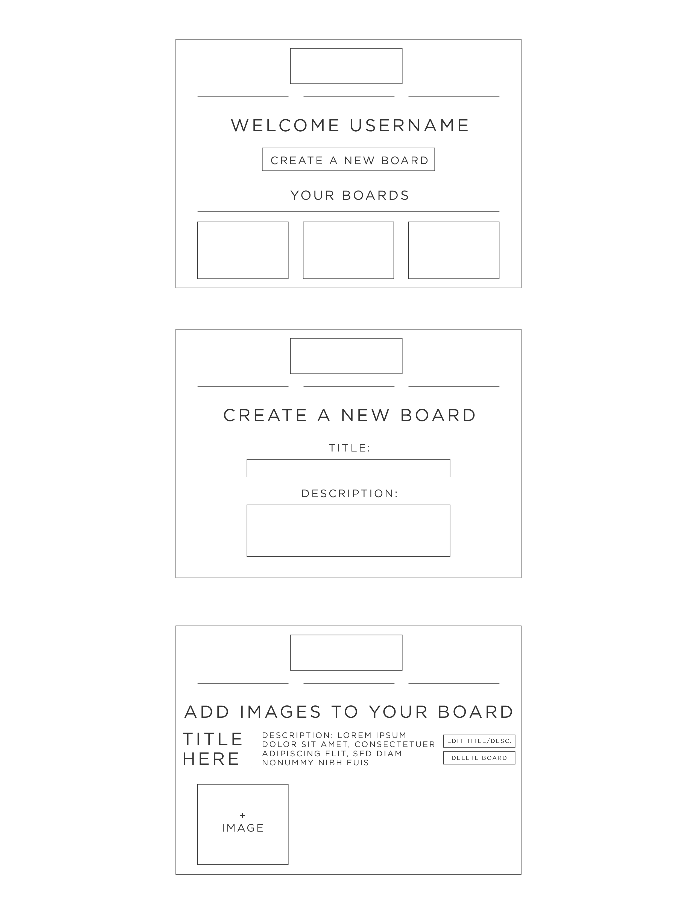
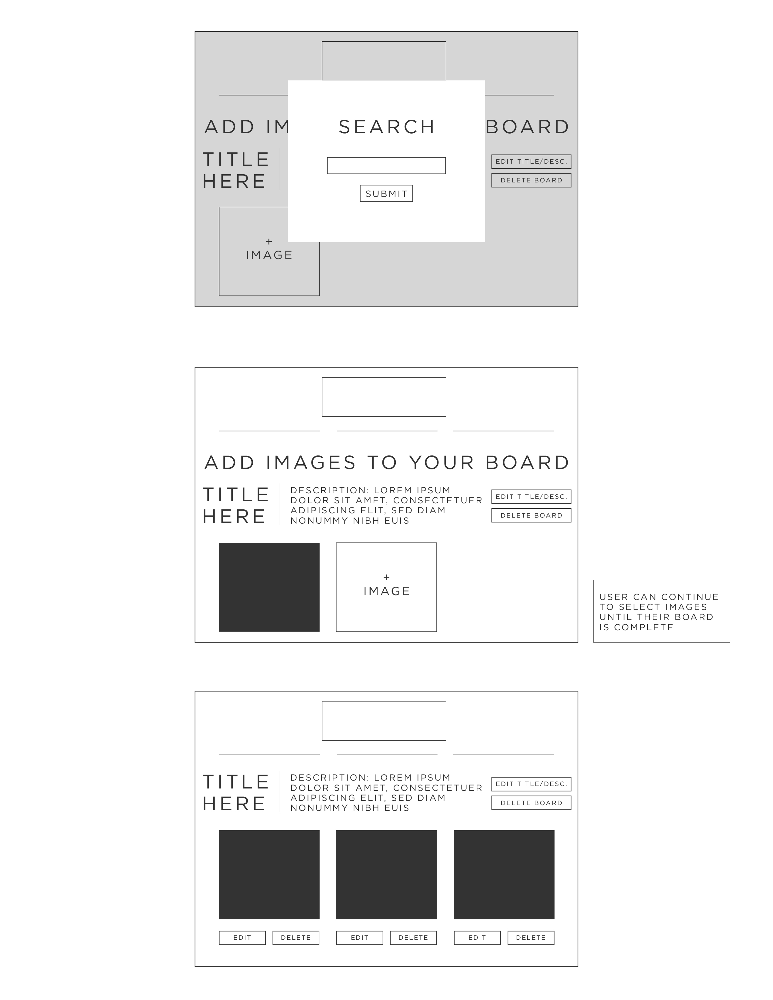

# Image Board Creator

## MVP/User Stories
1. Users login or register at the home screen.
    * Once logged in, users can view their created boards or make a new board
2. Creating a new board
    * User inputs a required title for the board and an optional description.
    * One image selector box is on page, when clicked, search modal pops up.
    * Upon submitting the search, app make a call to Unsplash API and pulls a random image link.
    * Image is populated where the image selector box was and new image selector box appears next to it.
3. User can continue searching for new images until their board is complete.

    * User can save board.
    * User can edit an image (takes them back to the search modal).
    * User can delete an image.
    * User can edit the title and description.
    * User can delete the entire board.
    * User can edit their username and password.

## Extras
1. Multiple grid options versus just adding them side by side.
2. Option to choose an image from 10 or so images from search.
3. Themed boards that anyone can add to (social element).

## Wireframes
  
   